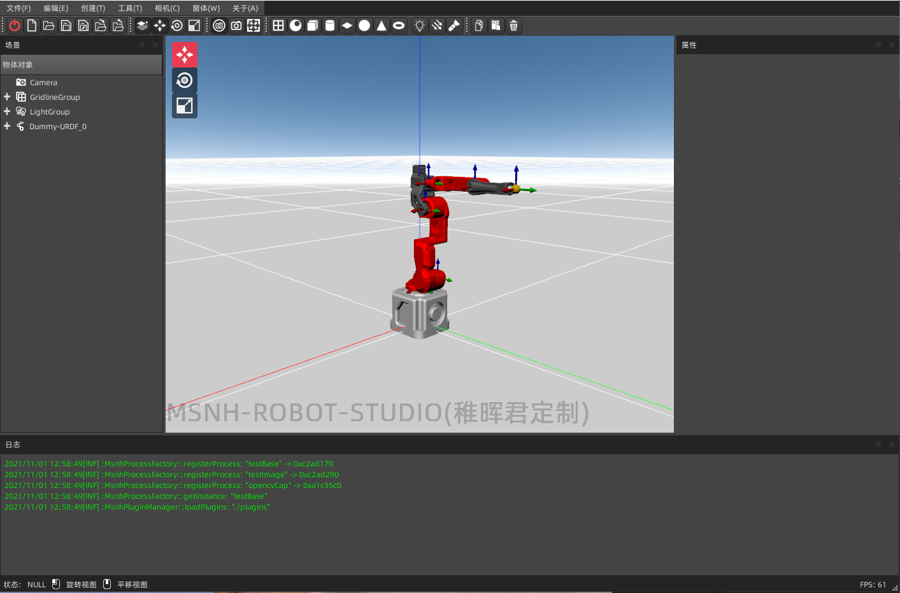
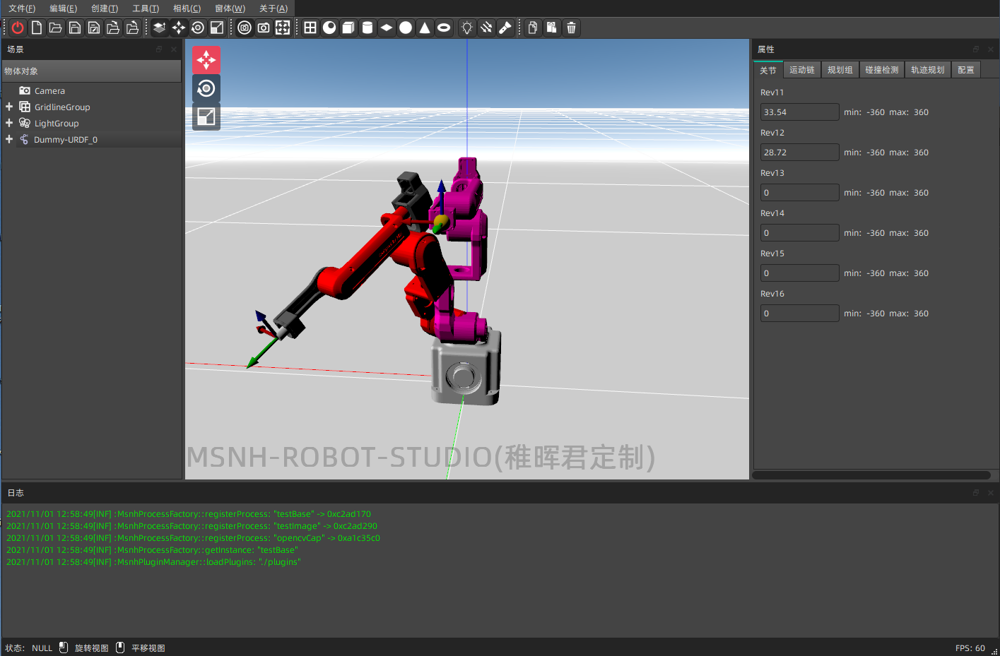
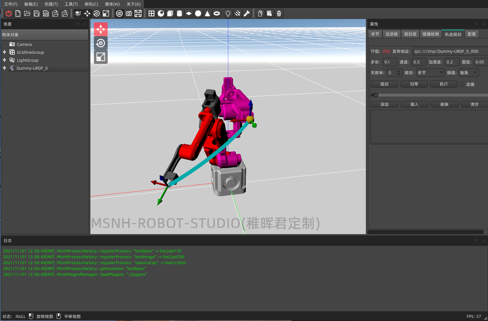

## DummyRobotStudio(稚晖君Dummy机器人上位机定制版)

### 申明 
本软件为免费软件,仅供个人学习使用,软件尚不完善且存在位置BUG,不得用于任何形式的商业用途,如果因使用本软件引发任何纠纷和事故,本人不承担任何直接或间接责任!软件开发不易,还望各位理解.技术交流知乎**穆士凝魂**.

### 下载链接
链接: https://pan.baidu.com/s/1jY1oFwODT-XkQWETBQSrPw 
提取码: fart
### 软件界面

### 关节控制

### 关节空间规划

### 笛卡尔空间规划
